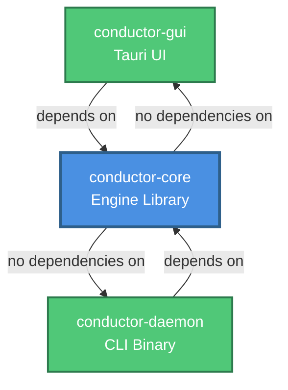

# Architecture Overview

## Current Architecture (v0.2.0 - Phase 2)

Conductor uses a **Cargo workspace architecture** with three packages. Phase 2 migration completed successfully with zero breaking changes.

### Workspace Packages

1. **conductor-core**: Pure Rust engine library (zero UI dependencies)
2. **conductor-daemon**: CLI daemon + 6 diagnostic tools
3. **conductor**: Backward compatibility layer for existing tests

### System Architecture

```
┌─────────────────────────────────────────────────────────────┐
│                    conductor-daemon                           │
│              (CLI Daemon + Diagnostic Tools)                │
├─────────────────────────────────────────────────────────────┤
│                                                             │
│   main.rs       6 diagnostic binaries                      │
│   (daemon)      (tools for MIDI/LED testing)               │
│                                                             │
│                      ▼  imports                             │
└──────────────────────┬──────────────────────────────────────┘
                       │
┌──────────────────────▼──────────────────────────────────────┐
│                    conductor-core                             │
│              (Pure Rust Engine Library)                     │
├─────────────────────────────────────────────────────────────┤
│  ┌─────────────┐    ┌──────────────┐    ┌──────────────┐  │
│  │   Config    │───▶│    Mapping   │◀──▶│  Feedback    │  │
│  │   Loader    │    │    Engine    │    │   System     │  │
│  └─────────────┘    └──────────────┘    └──────────────┘  │
│         │                   │                    │         │
│         │                   │                    │         │
│         ▼                   ▼                    ▼         │
│  ┌─────────────┐    ┌──────────────┐    ┌──────────────┐  │
│  │   Events    │    │    Event     │    │  HID/MIDI    │  │
│  │   Types     │    │  Processor   │    │   LEDs       │  │
│  └─────────────┘    └──────────────┘    └──────────────┘  │
│         │                   │                    │         │
│         │                   │                    │         │
│         ▼                   ▼                    ▼         │
│  ┌─────────────┐    ┌──────────────┐    ┌──────────────┐  │
│  │   Actions   │    │    Device    │    │    Error     │  │
│  │  Executor   │    │   Profiles   │    │    Types     │  │
│  └─────────────┘    └──────────────┘    └──────────────┘  │
│                                                             │
│  Zero UI dependencies • Public API • Reusable library      │
└─────────────────────────────────────────────────────────────┘
                       ▲
┌──────────────────────┴──────────────────────────────────────┐
│                      conductor (root)                         │
│               (Backward Compatibility Layer)                │
├─────────────────────────────────────────────────────────────┤
│  Re-exports conductor_core types for existing tests          │
│  Maintains v0.1.0 import paths • Zero breaking changes     │
└─────────────────────────────────────────────────────────────┘
```

### Event Processing Pipeline

The system uses a three-stage event processing architecture:

```
┌──────────────────┐
│   MIDI Device    │
└────────┬─────────┘
         │ Raw bytes
         ▼
┌──────────────────┐
│   MidiEvent      │  (Note On/Off, CC, Velocity)
└────────┬─────────┘
         │
         ▼
┌──────────────────┐
│ Event Processor  │  (State Machine)
│  - Velocity      │  - Soft/Med/Hard levels
│  - Long Press    │  - Hold detection (2000ms)
│  - Double-Tap    │  - Quick succession (300ms)
│  - Chord         │  - Simultaneous notes (50ms)
│  - Encoder       │  - Direction detection
└────────┬─────────┘
         │ ProcessedEvent
         ▼
┌──────────────────┐
│ Mapping Engine   │  (Mode-aware matching)
│  - Global maps   │
│  - Mode maps     │
│  - Trigger match │
└────────┬─────────┘
         │ Action
         ▼
┌──────────────────┐
│ Action Executor  │  (enigo for input simulation)
│  - Keystroke     │
│  - Shell         │
│  - Launch        │
│  - Volume        │
└──────────────────┘
```

### Core Components

#### main.rs
- **Entry Point**: CLI argument parsing, device enumeration
- **MIDI Connection**: Sets up `midir` input callbacks
- **Event Loop**: Coordinates event processing thread
- **Mode Management**: Tracks current mode via `AtomicU8`
- **Device Profiles**: Loads `.ncmm3` profiles for pad mapping

#### config.rs
- **Configuration Types**: `Config`, `Mode`, `Mapping`, `Trigger`, `ActionConfig`
- **TOML Parsing**: Loads and validates `config.toml`
- **Serialization**: Supports saving default configs

#### event_processor.rs
- **State Machine**: Transforms raw MIDI → ProcessedEvent
- **Timing Detection**: Long press, double-tap, hold threshold
- **Velocity Ranges**: Soft (0-40), Medium (41-80), Hard (81-127)
- **Chord Detection**: Buffers notes within 50ms window
- **Encoder Direction**: Detects clockwise/counterclockwise rotation

#### mappings.rs
- **Mapping Engine**: Matches `ProcessedEvent` → `Action`
- **Mode System**: Global mappings + per-mode mappings
- **Trigger Matching**: Supports Note, CC, Chord, Velocity, LongPress, DoubleTap
- **Compilation**: Converts `Trigger` config → `CompiledTrigger` for fast matching

#### actions.rs
- **Action Executor**: Executes compiled actions via `enigo`
- **Keystroke Simulation**: Key sequences with modifiers
- **Application Launch**: Platform-specific (macOS `open`, Linux `exec`, Windows `start`)
- **Shell Execution**: Runs arbitrary shell commands
- **Sequences**: Chains multiple actions with delays

#### feedback.rs
- **Trait Abstraction**: `PadFeedback` trait for LED control
- **Device Factory**: Creates HID (Mikro MK3) or MIDI feedback
- **Lighting Schemes**: Off, Static, Breathing, Pulse, Rainbow, Wave, Sparkle, Reactive, VuMeter, Spiral

#### mikro_leds.rs
- **HID Control**: Direct RGB LED control via `hidapi`
- **Maschine Mikro MK3**: Full RGB control, 16 pads
- **Shared Device Mode**: macOS shared access (runs alongside NI Controller Editor)
- **Effects**: Velocity feedback, mode colors, reactive lighting

#### midi_feedback.rs
- **Standard MIDI**: Fallback LED control via MIDI Note messages
- **Generic Devices**: Works with any MIDI device with LED support
- **Limited Features**: On/off only, no color control

#### device_profile.rs
- **NI Profile Parser**: Parses `.ncmm3` XML from Controller Editor
- **Pad Mapping**: Maps physical pad positions → MIDI notes
- **Page Support**: Handles pad pages (A-H) for multi-page controllers
- **Auto-Detection**: Detects active pad page from incoming MIDI

### Key Design Patterns

#### Mode System
Multiple modes (Default, Development, Media, etc.) allow different mapping sets. Each mode has:
- Distinct name and color theme
- Mode-specific mappings
- LED color scheme

Mode changes triggered by:
- Encoder rotation (CC messages)
- Specific pad combinations
- Programmatic mode switching

#### Global vs Mode Mappings
- **Global Mappings**: Active in all modes (e.g., emergency exit, encoder volume)
- **Mode Mappings**: Scoped to specific modes (e.g., dev tools in Development mode)

#### Profile-Based Note Mapping
Supports loading NI Controller Editor profiles (`.ncmm3`) to:
- Map physical pad positions to MIDI notes
- Handle different pad pages (A-H)
- Auto-detect active pad page from events
- Support custom controller configurations

#### LED Feedback System
Trait-based abstraction (`PadFeedback`) supports:
- **HID Devices**: Full RGB control (Maschine Mikro MK3)
- **MIDI Devices**: Basic on/off via MIDI Note messages

**Reactive Mode**: LEDs respond to velocity:
- Soft (green), Medium (yellow), Hard (red)
- Fade-out 1 second after release

**Mode Colors**: Distinct color themes per mode
- Mode 0: Blue
- Mode 1: Green
- Mode 2: Purple

### Threading and Concurrency

```
┌─────────────────────┐
│   Main Thread       │
│   - Config load     │
│   - Device connect  │
│   - Ctrl+C handler  │
└──────────┬──────────┘
           │
           ├─────────────────────────┐
           │                         │
           ▼                         ▼
┌─────────────────────┐   ┌─────────────────────┐
│   MIDI Callback     │   │   LED Effect        │
│   - Raw bytes       │   │   - Background      │
│   - crossbeam send  │   │   - Lighting loop   │
└──────────┬──────────┘   └─────────────────────┘
           │
           ▼
┌─────────────────────┐
│   Event Thread      │
│   - Process events  │
│   - Match mappings  │
│   - Execute actions │
└─────────────────────┘
```

**Current Threading Model**:
- **Main Thread**: Setup, config loading, signal handling
- **MIDI Callbacks**: Lock-free (via `crossbeam-channel`)
- **Event Thread**: Dedicated thread for event processing
- **LED Effects**: Optional background thread for lighting schemes

**Atomic State**:
- `AtomicU8` for current mode (lock-free reads/writes)
- `AtomicBool` for running flag (graceful shutdown)

### Performance Characteristics

- **Event Latency**: <1ms typical
- **Memory Usage**: 5-10MB
- **CPU Usage**: <1% idle, <5% active
- **Binary Size**: ~3-5MB (release with LTO)

### Dependencies

**Core Dependencies**:
- `midir`: Cross-platform MIDI I/O
- `enigo`: Keyboard/mouse simulation
- `hidapi`: HID device access (with `macos-shared-device`)
- `serde`/`toml`: Config parsing
- `quick-xml`: XML profile parsing
- `crossbeam-channel`: Lock-free event channels

**Platform-Specific**:
- macOS: AppleScript for volume control
- Linux: `xdotool` (optional, for input simulation)
- Windows: Native Windows APIs

## Future Phases (Phase 4+: GUI)

The roadmap includes migrating to a **workspace structure** with separate crates. See [Workspace Structure Design](../../docs/workspace-structure.md) for complete details (AMI-124).

### Target Structure

```
conductor/
├── Cargo.toml                      # Workspace root manifest
├── conductor-core/                   # Pure Rust engine (UI-free)
│   ├── Cargo.toml
│   └── src/
│       ├── lib.rs                  # Public API
│       ├── engine.rs               # MidiMonEngine
│       ├── config.rs               # Config types
│       ├── events.rs               # Event types
│       ├── mappings.rs             # Mapping engine
│       ├── actions.rs              # Action execution
│       ├── feedback.rs             # LED feedback
│       ├── device_profile.rs       # NI profile parser
│       └── error.rs                # Error types
├── conductor-daemon/                 # CLI binary (current main.rs)
│   ├── Cargo.toml
│   └── src/
│       ├── main.rs                 # CLI entry point
│       ├── cli.rs                  # Argument parsing
│       ├── debug.rs                # Debug output
│       └── bin/                    # Diagnostic tools
├── conductor-gui/                    # Tauri UI (Phase 4)
│   ├── Cargo.toml
│   ├── src-tauri/
│   └── ui/
└── config/                         # Config templates
    ├── default.toml
    ├── examples/
    └── device_templates/
```

### Workspace Dependency Graph



### Phase 2: Core Library Extraction ✅ COMPLETE (v0.2.0)

**Goal**: Extract engine logic into reusable `conductor-core` crate (AMI-123, AMI-124).

**Public API** (from [API Design](../../docs/api-design.md)):
```rust
pub struct MidiMonEngine;
impl MidiMonEngine {
    pub fn new(config: Config) -> Result<Self, EngineError>;
    pub fn start(&mut self) -> Result<(), EngineError>;
    pub fn stop(&mut self) -> Result<(), EngineError>;
    pub fn reload_config(&mut self, config: Config) -> Result<(), EngineError>;
    pub fn current_mode(&self) -> u8;
    pub fn set_mode(&mut self, mode: u8) -> Result<(), EngineError>;
    pub fn config(&self) -> Config;
    pub fn stats(&self) -> EngineStats;

    // Callbacks for integration
    pub fn on_mode_change<F>(&mut self, callback: F)
    where F: Fn(u8) + Send + 'static;

    pub fn on_action<F>(&mut self, callback: F)
    where F: Fn(&ProcessedEvent, &Action) + Send + 'static;
}
```

**Module Separation**:
- **Public Modules**: `config`, `engine`, `events`, `actions`, `feedback`, `device`, `error`
- **Private Modules**: `event_processor`, `timing`, `chord`, `velocity`

**Benefits**:
- Reusable engine for CLI, daemon, GUI
- Zero UI dependencies in core (no `colored`, `chrono` for display)
- Clean API boundaries with trait-based abstractions
- Easier testing and integration
- Thread-safe with Arc/RwLock for shared state

**Build Commands**:
```bash
# Build core library only
cargo build -p conductor-core

# Build CLI daemon
cargo build -p conductor-daemon --release

# Run with new structure
cargo run -p conductor-daemon --release -- 2 --led reactive

# Test workspace
cargo test --workspace
```

### Phase 3: Daemon and Menu Bar

**Goal**: Add `conductor-daemon` with macOS menu bar integration.

**Features**:
- System tray icon with status
- Quick actions (Pause, Reload, Open Config)
- Config hot-reloading via `notify` crate
- Auto-start via LaunchAgent or Tauri autostart plugin
- Frontmost app detection for per-app profiles

**Integration Pattern**:
```rust
use conductor_core::{Config, MidiMonEngine};

fn main() -> Result<()> {
    let config = Config::load("config.toml")?;
    let mut engine = MidiMonEngine::new(config)?;

    // Register callbacks for UI updates
    engine.on_mode_change(|mode| {
        update_menu_bar_icon(mode);
    });

    engine.start()?;
    Ok(())
}
```

### Phase 4: GUI Configuration

**Goal**: Add `conductor-gui` with Tauri-based visual config editor.

**Features**:
- Visual device mapping with SVG pad layouts
- MIDI Learn mode (click → press → bind)
- Profile management (import/export/share)
- Live event console with filtering
- Velocity curve editor
- Test bindings without saving

**UI Components**:
- Device visualizer (16-pad grid for Maschine Mikro MK3)
- Mapping editor (trigger → action configuration)
- Profile switcher (per-app profiles)
- Event log (real-time MIDI/HID events)
- Settings panel (advanced timing, thresholds)

## Configuration Backward Compatibility

**Core Commitment**: Configuration files created for v0.1.0 will work in all v1.x.x versions without modification.

### Stability Guarantees

| Section | v0.1.0 | v0.2.0 | v1.0.0 | Stability |
|---------|--------|--------|--------|-----------|
| `[device]` | ✅ | ✅ | ✅ | **Stable** |
| `[[modes]]` | ✅ | ✅ | ✅ | **Stable** |
| `[[global_mappings]]` | ✅ | ✅ | ✅ | **Stable** (optional, defaults to empty) |
| `[advanced_settings]` | ⚠️  | ✅ | ✅ | **Optional** (defaults provided) |

**Legend**:
- ✅ **Fully Supported**: Section works identically across versions
- ⚠️  **Optional**: Section is optional with sensible defaults

### Version Compatibility

```
v0.1.0 config → v0.2.0 engine ✅ (100% compatible)
v0.1.0 config → v1.0.0 engine ✅ (100% compatible)

v0.2.0 config → v0.1.0 engine ⚠️  (new features ignored with warnings)
v1.0.0 config → v0.1.0 engine ⚠️  (new features ignored with warnings)
```

### Deprecation Policy

Conductor follows **semantic versioning** (SemVer) for configuration:

- **Major version (x.0.0)**: May introduce breaking changes with migration tools
- **Minor version (0.x.0)**: Adds features in backward-compatible manner
- **Patch version (0.0.x)**: Bug fixes only, no config changes

**Breaking changes** require:
1. Deprecation notice (version N)
2. Deprecation period with warnings (version N+1)
3. Removal with migration tool (version N+2, major bump)

### Test Coverage

All v0.1.0 configuration examples are validated in CI/CD via `tests/config_compatibility_test.rs`:

- **CFG-001**: Basic config.toml loads without errors
- **CFG-003**: Minimal device-only configs use defaults
- **CFG-004**: All trigger types parse correctly
- **CFG-005**: All action types parse correctly
- **CFG-006**: Complex sequences work
- **CFG-007**: Multiple modes supported
- **CFG-009**: Legacy v0.1.0 syntax always works
- **CFG-010**: Invalid syntax produces clear error messages

**Coverage Requirements**:
- 100% coverage for config parsing (`src/config.rs`)
- All documentation examples must parse successfully
- Regression tests for every released version

For complete details, see: **[Configuration Backward Compatibility Strategy](../../docs/config-compatibility.md)**

---

## API Design

For detailed public API design (Phase 2+), see:
- **[API Design Document](../../docs/api-design.md)** - Complete API specification (AMI-123)
- **[Configuration Compatibility](../../docs/config-compatibility.md)** - Backward compatibility strategy (AMI-125)
- **[Implementation Viewpoint 1](../../.research/implementation-viewpoint-1.md)** - Monorepo with Tauri
- **[Implementation Viewpoint 2](../../.research/implementation-viewpoint-2.md)** - Alternative approach

## Related Documentation

- [Configuration Overview](../configuration/overview.md)
- [Device Profiles](../configuration/device-profiles.md)
- [LED Feedback System](../configuration/led-feedback.md)
- [Contributing Guide](contributing.md)
- [Testing Strategy](testing.md)
